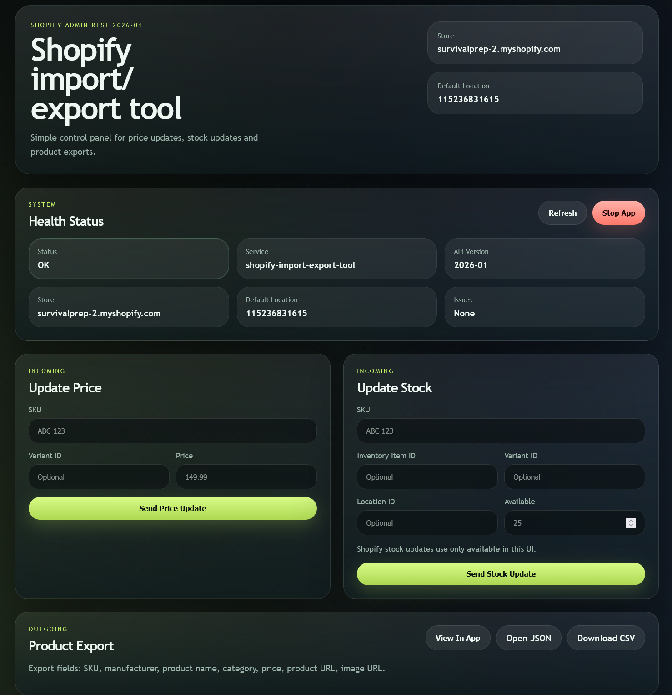

# Shopify import/export tool

Aplicatie Flask simpla pentru:

- update pret in Shopify
- update stoc in Shopify
- export produse in JSON
- export produse in CSV
- folosire prin GUI local in browser

## GUI local

Modul principal de folosire este prin interfata grafica locala din browser.

Deschide:

```text
http://localhost:5000/
```

Preview:



## Ce iti trebuie

- Python `3.11+`
- un `Shopify Admin API access token`
- un fisier `.env`

Scope-uri recomandate pentru Shopify:

- `read_products`
- `write_products`
- `read_inventory`
- `write_inventory`

## Configurare

1. Creeaza `.env` din `.env.example`
2. Completeaza valorile reale

Exemplu:

```env
SHOP_DOMAIN=survivalprep-2.myshopify.com
SHOPIFY_ACCESS_TOKEN=shpat_xxx
DEFAULT_LOCATION_ID=1234567890
PORT=5000
```

## Pornire rapida

### Windows

Pornire:

```powershell
.\start_app.ps1
```

Oprire:

```powershell
.\stop_app.ps1
```

Sau dublu click:

- `launch_app.bat`
- `stop_app.bat`

### macOS

Prima data:

```bash
chmod +x start_app.sh stop_app.sh launch_app.command stop_app.command
```

Pornire:

```bash
./start_app.sh
```

Oprire:

```bash
./stop_app.sh
```

Sau dublu click:

- `launch_app.command`
- `stop_app.command`

## Pornire manuala

### macOS / Linux

```bash
python3 -m venv .venv
source .venv/bin/activate
pip install -r requirements.txt
cp .env.example .env
python app.py
```

### Windows PowerShell

```powershell
python -m venv .venv
.venv\Scripts\Activate.ps1
pip install -r requirements.txt
Copy-Item .env.example .env
python app.py
```

## Ce fac scripturile de start

- creeaza `.venv` daca lipseste
- instaleaza dependentele
- opresc instanta veche de pe portul aplicatiei
- pornesc aplicatia
- salveaza PID-ul in `logs/app.pid`
- deschid browserul automat

Pe macOS scripturile folosesc:

- `python3`
- `lsof`
- `curl`
- `open`

## Ce poti face in aplicatie

- folosesti totul din GUI, fara sa trimiti requesturi manual daca nu vrei
- vezi starea configurarii prin `Health`
- faci `Update Price`
- faci `Update Stock`
- vezi exportul de produse in UI
- descarci CSV
- filtrezi, sortezi si paginezi tabelul

Practic:

- pornesti aplicatia
- deschizi GUI-ul in browser
- faci update sau export direct din interfata
- folosesti endpointurile doar daca vrei integrare externa sau teste in Postman

## Endpointuri

- `GET /health`
- `POST /incoming/update-price`
- `POST /incoming/update-stock`
- `GET /outgoing/products.json`
- `GET /outgoing/products.csv`

## Exemple rapide

### Update price dupa SKU

```bash
curl -X POST http://localhost:5000/incoming/update-price \
  -H "Content-Type: application/json" \
  -d '{"sku":"ABC-123","price":"149.99"}'
```

### Update stock dupa SKU

```bash
curl -X POST http://localhost:5000/incoming/update-stock \
  -H "Content-Type: application/json" \
  -d '{"sku":"ABC-123","available":25}'
```

### Export JSON

```bash
curl http://localhost:5000/outgoing/products.json
```

### Export CSV

```bash
curl http://localhost:5000/outgoing/products.csv -o products.csv
```

## Observatii

- cautarea dupa SKU face match exact pe `variant.sku`
- `manufacturer = vendor`
- `category = product_type`
- `product_url = https://{SHOP_DOMAIN}/products/{handle}`
- `image_url = prima imagine disponibila`
- daca `location_id` lipseste, se foloseste `DEFAULT_LOCATION_ID`
